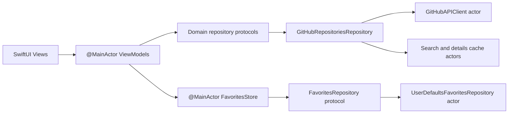

# GitHubClient

GitHubClient is an iOS application for exploring public GitHub repositories,
viewing repository metadata and README content, and maintaining a locally
persisted list of favorites.

The repository demonstrates MVVM, layer separation, structured concurrency,
dependency injection, bounded caching, and concurrency testing in a compact,
maintainable SwiftUI codebase.

## Features

- Debounced repository search with cancellation, retry, and incomplete-result
  handling
- Pagination for additional search results
- Repository details with owner information, statistics, topics, dates,
  external links, and asynchronously loaded avatars
- Raw-text README loading that fails independently from repository details
- Shared favorite state across Search, Repository Details, and Favorites
- Optimistic favorite updates with rollback when persistence fails
- Favorite repository ID persistence through `UserDefaults`
- Favorites refresh and partial-failure handling, with at most four concurrent
  repository-summary requests
- Bounded, expiring in-memory caches for search pages and repository details
- Stable user-facing errors for transport, decoding, authorization, rate-limit,
  and server failures

## Architecture

The project follows MVVM with Presentation, Domain, and Data layers organized
within a single application target.

ViewModels and the shared favorites store run on `MainActor`. Mutable
networking, cache, and persistence implementations use actor isolation where
shown below.



See [ARCHITECTURE.md](ARCHITECTURE.md) for the implemented design and
[Architecture Decision Records](docs/adr/) for the rationale behind the
project's boundaries, concurrency model, persistence, caching, and testing
strategy.

## Project Structure

```text
GitHubClient/
├── App/                    Composition root and typed routes
├── Data/
│   ├── Cache/              Search and details memory caches
│   ├── GitHubAPI/          Endpoints, transport, and DTOs
│   ├── Persistence/        Favorites persistence
│   └── Repositories/       Data-to-Domain repository implementation
├── Domain/
│   ├── Models/             Immutable application models
│   └── Repositories/       Data-access protocols
├── Features/
│   ├── Favorites/          Shared favorite state
│   ├── FavoritesList/      Persisted favorites screen
│   ├── RepositoryDetails/  Details and README presentation
│   └── Search/             Search and pagination presentation
└── Shared/                 Cross-feature presentation contracts

GitHubClientTests/          Unit and concurrency tests
docs/adr/                   Accepted architecture decisions
```

## Technology Stack

- Swift
- SwiftUI
- Observation
- Swift Concurrency with `async`/`await`, owned tasks, task groups, and
  actors
- `URLSession`
- `UserDefaults`
- GitHub REST API
- Swift Testing
- GitHub Actions

The application uses Apple platform frameworks and has no third-party package
dependencies.

## Key Engineering Decisions

- **Async ownership** — **Problem:** Work can outlive its screen and update
  stale UI. **Approach:** ViewModels retain and cancel task handles.
  **Benefit:** Lifecycle behavior remains explicit.
- **Stale-result protection** — **Problem:** Cancellation cannot prevent every
  late completion. **Approach:** Request identities and generations identify
  the current owner. **Benefit:** Older results cannot replace newer state.
- **Bounded caching** — **Problem:** Unbounded or permanently fresh caches can
  grow and serve stale data. **Approach:** Actor-isolated LRU caches use
  five-minute freshness windows and fixed capacities. **Benefit:** Memory use
  and eviction remain predictable.
- **Consistent favorites** — **Problem:** Independent screen state can diverge.
  **Approach:** One `FavoritesStore` applies optimistic updates, rollback, and
  serialized writes per repository ID. **Benefit:** Screens converge on the
  latest user intent.
- **Dependency injection** — **Problem:** Concrete infrastructure in ViewModels
  would couple presentation to Data. **Approach:** `AppContainer` injects Domain
  protocols. **Benefit:** Features remain replaceable in tests.
- **Error boundaries** — **Problem:** Raw transport failures are unsuitable
  presentation contracts. **Approach:** The Data repository maps them to stable
  `AppError` values. **Benefit:** UI behavior stays consistent while diagnostics
  remain in the Data layer.

## Testing

The Swift Testing suite covers endpoint construction, decoding and mapping,
error translation, pagination, retry, cancellation, cache freshness and
eviction, persistence, optimistic favorite updates, bounded concurrent loading,
refresh, and partial failures.

Controlled repositories, controlled fakes, and checked continuations protect
critical async ownership, race-condition, and stale-result scenarios.
Regression tests verify that stale search, pagination, details, and
favorite-write completions cannot overwrite newer intent.

Some older tests still use bounded polling or short delays. The suite is
therefore not described as completely timing-independent.

CI builds the application, runs the unit test suite, and performs static
analysis with compiler and analyzer warnings treated as errors.

## Running

Requirements:

- Developed and validated with Xcode 26.6
- iOS 26.0 deployment target
- An available iOS Simulator

The project has no external dependencies and requires no additional setup.

Clone the repository and open the project:

```bash
git clone https://github.com/andreynl/GitHubClient.git
cd GitHubClient
open GitHubClient.xcodeproj
```

Build from the command line:

```bash
xcodebuild \
  -project GitHubClient.xcodeproj \
  -scheme GitHubClient \
  -configuration Debug \
  -destination 'generic/platform=iOS Simulator' \
  CODE_SIGNING_ALLOWED=NO \
  build
```

Run tests by replacing `<SIMULATOR-UDID>` with an identifier from
`xcrun simctl list devices available`:

```bash
xcodebuild \
  -project GitHubClient.xcodeproj \
  -scheme GitHubClient \
  -configuration Debug \
  -destination 'platform=iOS Simulator,id=<SIMULATOR-UDID>' \
  CODE_SIGNING_ALLOWED=NO \
  test
```

The live configuration uses GitHub's unauthenticated public API. The code
supports an injected access-token provider, but the application does not ship
with credentials.

## Future Improvements

- Advanced search filters
- Search history
- Offline access to previously loaded repository content
- Persistent image caching for repository owner avatars
- Focused UI smoke and snapshot coverage
